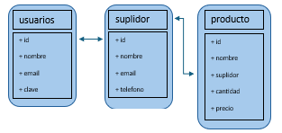
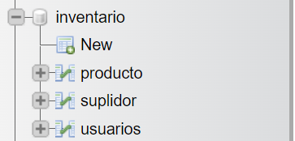

# Final Project for Comp 3015

Descripción del proyecto:
- Proyecto final que requería programar una aplicación que te dejaba utilizar una base de datos para añadir, editar, quitar y listar información.

Qué hace la aplicación:
- La aplicación le deja almacenar información de un usuario producto o suplidor de producto en una base de datos, al igual de editar, borrar y listar esa información.

Qué tecnología se utiliza:
- La tecnología que se utilizó fue XAMPP para Apache, MySQL y phpMyAdmin y también se utilizó VSCODE.
- El lenguaje que se utilizo fue mayormente PHP y se utilizó también Bootstrap, HTML, CSS, Javascript.

Descripción de las tablas: 
* Las tablas de base de dato son las de los usuarios(usuarios), los productos(producto) y la de los suplidores(suplidor) todas están adentro de un file llamado “inventario”.

* La tabla de los usuarios guarda toda la data de los usuarios. Las variables guardadas son la del id(int), el nombre(string/vanchar), el email(string/vanchar) y clave(string/vanchar).

* La tabla de producto guarda toda la data de los productos. Las variables guardadas son la del id(int), el nombre(string/vanchar),  el suplidor(string/vanchar), la cantidad(double) y el precio(double).

* La tabla de suplidor guarda toda la data del suplidor de los productos. Las variables guardadas son la del id(int), el nombre(string/vanchar), el email(string/vanchar) y el telefono(string/vanchar).

El diagrama ER de la base de Datos:
-  

Screenshoots con descripción:
- 
- Lista de las tablas(usuarios, producto y suplidor) en el servidor. ^

- 
- Lista de la tabla de los usuarios en el servidor. ^

- 
- Lista de la tabla de los productos en el servidor. ^!

- [lista_suplidor](images/lista_suplidor.png)
- Lista de la tabla de los suplidores en el servidor. ^!